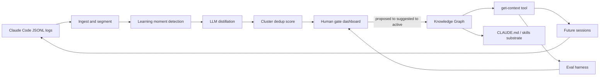

# PRAXIS

**Self-improving knowledge loop for Claude Code agents.**

[](pyproject.toml)
[](frontend-react/README.md)
[](session-capture/README.md)
[](docs/integration/candidate-api-v1.md)

Claude Code's auto-memory saves a few notes between sessions — but it's an unverified black box: no human approval, no deduplication, no measurement. **PRAXIS** mines the full JSONL session logs the agent already produces, distills durable lessons, runs them through a confidence score and human-approval gate, and injects only promoted knowledge into future sessions — so the agent provably stops relearning the same things and gets better over time.

> **Memory vs. knowledge.** Auto-memory captures scattered, episodic notes. PRAXIS produces generalized, deduplicated, confidence-scored, human-approved, measured knowledge with full provenance.

**Remote:** [GitLab — monicapeters/praxis](https://labs.gauntletai.com/monicapeters/praxis)  
**Architecture source of truth:** [docs/plans/PRAXIS_Project_Plan.html](docs/plans/PRAXIS_Project_Plan.html)

---

## Table of contents

- [The loop](#the-loop)
- [Problem](#problem)
- [Implementation status](#implementation-status)
- [Sprint TODO (team tracker)](#sprint-todo-team-tracker)
- [MVP scope](#mvp-scope)
- [Success criteria](#success-criteria)
- [Team & pillars](#team--pillars)
- [Sprint timeline](#sprint-timeline)
- [Repository layout](#repository-layout)
- [Prerequisites](#prerequisites)
- [Quick start](#quick-start)
- [Configuration](#configuration)
- [Testing](#testing)
- [Documentation](#documentation)
- [Contributing](#contributing)
- [License](#license)
- [Changelog](#changelog)

---

## The loop

```text
raw logs → extract candidate lessons → consolidate/dedup/generalize → confidence score
         → [human approval gate] → Knowledge Graph → get-context tool → future sessions
         → measure improvement → repeat
```



---

## Problem

Coding agents are less amnesiac than they used to be, but durable knowledge still lives in the gaps:

- **No quality gate** — save decisions are opaque; wrong patterns can be memorized from one-off mistakes.
- **No dedup, decay, or conflict resolution** — stale and contradictory notes coexist indefinitely.
- **No measurement** — nothing verifies a saved memory actually helped a later session.
- **Per-repository only** — nothing carries across projects, models, or domains.
- **Underused raw material** — full JSONL transcripts (`~/.claude/projects/<project>/<session>.jsonl`) record every mistake, correction, and success; auto-memory skims in-flight and discards the rest.

PRAXIS treats that exhaust as a compounding asset.

### Capstone Alignment (PRD)

See the **🎯 Capstone Alignment (PRD)** highlight box in [docs/plans/PRAXIS_Project_Plan.html](docs/plans/PRAXIS_Project_Plan.html) for the three capstone directions satisfied by this project:

- **Combine ML with LLM:** Classical ML (HDBSCAN clustering, confidence scoring) pairs with LLM distillation
- **Different take on agents:** Shared agent works through a team, humans verify — the *substrate* improves while agents stay stateless
- **One problem, many approaches:** Knowledge retrieval benchmarked across markdown/skills, vector RAG, knowledge graph, and RAG+rerank

---


## Implementation status

Point-in-time snapshot as of **2026-06-21** (aligned to praxis-lite). Live gap tracker: [PLAN_ALIGNMENT_GAP_CHECKLIST.md](PLAN_ALIGNMENT_GAP_CHECKLIST.md). See [AUDIT.md](AUDIT.md) for repo health review.

| Area | Path | Owner | Status |
|------|------|-------|--------|
| Human-gate dashboard (React) | `frontend-react/` | Monica Peters (client) / Matthew Daw (server) | **Demo-ready (mock)** — Vite + TypeScript UI targeting candidate-api-v1 |
| Dashboard contract layer (Python) | `frontend/` | Monica Peters | **Shipped** — mock fixtures, contract v1 reference client, pytest contract tests |
| Knowledge substrate | `knowledge/` | Matthew Daw | **Foundation** — in-memory + pgvector graphs, prompt ingestor, whole-file reader, write-policy (dedupe/redact/conflict), OpenRouter LLM/embedder seam, wiring factory |
| Eval harness | `knowledge/evals/` | Dominic Antonelli | **Partial** — 69 YAML cases, deterministic checks, real Claude Code runner + offline FakeRunner |
| Session capture | `session-capture/` | Dominic Antonelli | **Not present in this lite checkout** — planned for full system; lite focuses on core loop (JSONL → candidates → human gate → KG) |
| Cloud infra | `infra/` | Matthew Daw | **Not present in this lite checkout** — planned for full system; Render blueprints exist in `frontend-react/render.yaml` |
| Candidate REST API | `knowledge/serve/` | Matthew Daw | **Shipped** — FastAPI contract v1; full CRUD; JSON store or Postgres via `PRAXIS_DB_URL`; Cognito-JWT auth + multi-tenant orgs |
| Auth & multi-tenancy | `knowledge/serve/` (`auth.py`, `orgs_store.py`) | Matthew Daw | **Shipped** — Cognito JWT verification, per-user tenancy, password-gated orgs; `PRAXIS_AUTH_DISABLED=1` dev seam |
| Hosting | `Dockerfile`, `render.yaml` (frontend-react) | Matthew Daw | **Render blueprints present** — AWS App Runner + CloudFront (CDK) live in the parallel full-system repo |
| Eval metrics endpoint | `knowledge/serve/` (`GET /metrics`) | Dominic Antonelli | **Fixture only** — contract v1 documented; dashboard embed ready; real batch data pending |
| CI pipeline | — | Team | **Not yet** — manual test runs only |

**Integration posture:** The dashboard runs fully offline when `PRAXIS_API_BASE_URL` is unset. Set env vars per [docs/integration/wire-up.md](docs/integration/wire-up.md) to wire live backend and eval metrics without code changes.

**Lite repo scope:** This checkout (`praxis-lite`) demonstrates the core loop end-to-end (ingest → distill → human gate → promote → KG → get-context) using local mocks + Render blueprints. Full-system components (`session-capture/`, `infra/` CDK, Go PTY daemon) live in the parallel non-lite work and are intentionally absent here.

**Critical path (Jun 29 demo):** Matthew pipeline (JSONL → candidates → promote→KG) and Dominic measurement spine (cold vs injected + compounding curve). Dashboard Act 2 is mock-ready today.

---

## Sprint TODO (team tracker)

> **Last updated:** 2026-06-19 (Sprint Day 3). Detailed day-by-day gaps: [PLAN_ALIGNMENT_GAP_CHECKLIST.md](PLAN_ALIGNMENT_GAP_CHECKLIST.md). Tick items in MRs; Monica updates this block at daily sync.

| Milestone | Date | Days away |
|-----------|------|-----------|
| Integration complete (Day 7) | Tue Jun 24 EOD | 5 |
| Feature freeze (Day 8) | Wed Jun 25 EOD | 6 |
| Practice 1 | Wed Jun 25 | 6 |
| Hard freeze (Day 10) | Fri Jun 27 EOD | 8 |
| Demo branch `demo-jun29` | Sun Jun 28 AM | 9 |
| **Gauntlet showcase** | **Mon Jun 29** | **10** |

### Critical path (P0 — blocks live demo)

**Matthew (ML & Knowledge Pipeline)**

- [ ] JSONL ingest + episode segmentation (`knowledge/ingestion/` — rename from `injestion/` when ready)
- [ ] LLM distillation → structured candidate `{when, lesson, scope, evidence, form}` with provenance `logs/*.jsonl:<line>`
- [ ] Learning-moment detector (heuristics minimum for demo)
- [ ] **Promote → `KnowledgeGraph.write`** (approval in dashboard must persist to graph, not candidate store only)
- [ ] PostgreSQL RDS provisioned + `PRAXIS_DB_URL` live ([RDS_KG_DEPLOY.md](RDS_KG_DEPLOY.md))
- [ ] Acknowledge Monica P0 eval cases in [MATTHEW_HANDOFF.md](knowledge/evals/cases/MATTHEW_HANDOFF.md) (`quirky_exhaustive_switch`, `quirky_config_load_order`)

**Dominic (Arch, Eval & Integration)**

- [ ] Paired **cold vs injected** runner (same case, empty graph vs seeded insight)
- [ ] **Correction counting** + token/time in eval results
- [ ] Eval metrics GET per [eval-metrics-v1.md](docs/integration/eval-metrics-v1.md) (real batch data, not fixture-only)
- [ ] Quirky benchmark wired for Acts 1 & 3 (`quirky_exhaustive_switch` pairing)
- [ ] Compounding curve output proving **≥50% correction reduction** (or dated honest narrative + fixture fallback)

**Monica (Dashboard & Human Gate)**

- [x] Human-gate UI mock-complete (React dashboard + Python contract v1 client)
- [x] P0 eval cases + `test_cases.py` green
- [ ] Live integration smoke: promote/reject/resolve chain on Matthew API ([INTEGRATION_SMOKE.md](INTEGRATION_SMOKE.md))
- [ ] Timed **Act 2** rehearsal ≤3.5 min ([DEMO_SCRIPT.md](DEMO_SCRIPT.md))

**Team**

- [ ] End-to-end path: **log → candidates → promote → eval improved**
- [ ] 3-act demo script with fallback matrix (Act 1 clip OK; Act 2 mock OK today; Act 3 fixture metrics fallback documented)

### Remaining sprint schedule (open work)

- **Day 3 (Jun 19 — today):** Matthew: distillation + provenance · Dominic: injection tooling · Monica: Act 2 rehearsal
- **Day 4 (Jun 20):** Matthew: embeddings/HDBSCAN/contradiction pipeline · Dominic: PR/ticket replay skeleton
- **Day 5 (Jun 21):** Matthew: freq/recency/breadth + decay · Dominic: token/time tracking
- **Day 6 (Jun 23):** Matthew: E2E pipeline + RDS · Dominic: cold vs injected runner · Monica: live API smoke
- **Day 7 (Jun 24):** Matthew: get-context tool + promote→KG · Dominic: demo data bundle · **integration complete EOD**
- **Day 8 (Jun 25):** Batch evals + compounding measurement · Monica Practice 1 · **feature freeze EOD**
- **Days 9–10 (Jun 26–27):** Demo polish, user-flow video, Practice 2, hard freeze Fri 27
- **Showcase (Jun 29):** 10-min live demo (3 acts)

### Demo & presentation gates

- [ ] **Practice 1** — Wed Jun 25 — all 3 acts ≤10 min; mock dashboard OK
- [ ] **Practice 2** — Fri Jun 27 — live API + eval metrics preferred
- [ ] **Practice 3** — Sun Jun 28 PM — dress rehearsal; no code after unless P0
- [ ] Tag **`demo-jun29`** — Sun Jun 28 AM
- [ ] Backup recording captured
- [ ] Monica: user-flow video ≤3 min (React primary)
- [ ] Monica: manual a11y pass (tab + screen reader) per [DAYS_9_10_REMAINING.md](DAYS_9_10_REMAINING.md)
- [ ] Dominic: full 3-act spoken script (Act 1 dumb agent · Act 2 distillation · Act 3 smart agent + scoreboard)

### P1 (after P0 or stretch)

- [ ] HDBSCAN cluster/dedup (Matthew)
- [ ] Pipeline-side contradiction detection (Matthew)
- [ ] Real confidence scorer from logs (Matthew)
- [ ] GitHub hook / PR automation on promote (Dominic)
- [ ] GitLab CI: `pytest knowledge/`, `frontend/tests/`, `frontend-react` Vitest
- [ ] State-distribution chart (Monica stretch)

### How to update this list

- Monica ticks items at daily 10am sync; pillar leads confirm in MR before checking `[x]`
- Link MR/commit in standup notes under `docs/standup-notes/`
- Do not check integration/E2E items until smoke doc or pytest proves it
- After Jun 25 feature freeze: bugfixes + measurement only

---

## MVP scope

| In scope | Out of scope |
|----------|--------------|
| Ingest + segment real Claude Code JSONL logs | Training models from scratch |
| Learning-moment detection (heuristics + LLM) | Hosted SaaS |
| LLM distillation with provenance | Non–Claude-Code agents |
| Cluster/dedup + confidence scoring | Real-time mid-session learning |
| Knowledge Graph as primary knowledge store | |
| get-context tool (session + codebase + graph → injected context) | |
| React human-gate dashboard in `frontend-react/` (`proposed → suggested → active`) | |
| Complementary injection via generated `CLAUDE.md` / skills | |
| Eval harness measuring correction rate before/after (VCS-agnostic PR/ticket replay) | |

**Implemented beyond MVP shell:** contradiction-resolution UI (dashboard); React client for Matthew API validation; FastAPI candidate API with full CRUD; Cognito JWT auth + password-gated multi-tenant orgs; pgvector graph store; AWS App Runner + CloudFront hosting (CDK).

**Stretch goals:** trained classifier for learning moments; substrate bake-off (markdown/skills vs. vector RAG vs. knowledge graph); confidence decay and re-verification; pipeline-side contradiction **detection**; cross-project knowledge.

---

## Success criteria

- **Primary metric:** ≥50% fewer user corrections on benchmark tasks vs. cold runs, with no regression in task success rate.
- **Compounding proof:** visible correction-rate curve falling across sessions.
- **Demo outcome:** point PRAXIS at a repo's logs → ranked candidate lessons with evidence in minutes → human promotes the good ones → re-run shows quantified improvement (corrections, failures, tokens, time).

---

## Team & pillars

Three Gauntlet AI Fellows collaborating on a production-grade capstone. Each member leads one distinct, high-impact aspect of the project. Monica Peters serves as Scrum Master for daily 10:00 AM syncs and builds the **Lite version** (this repo) demonstrating the core loop end-to-end.

| Lead | Pillar | Focus |
|------|--------|-------|
| **Matthew Daw** | ML & Knowledge Pipeline | Ingestion, learning moment detection (ML classifier), LLM distillation, consolidation/dedup/scoring, knowledge graph, provenance.<br><em>Interview claim: "I led the ML-powered distillation engine that turns raw JSONL logs into scored, deduplicated, human-approved knowledge with full provenance."</em> |
| **Monica Peters** | Dashboard & Human Gate | React human-gate dashboard (`frontend-react/`) plus Python contract layer (`frontend/`), approval workflow (proposed→suggested→active), contradiction resolution UI, credibility metrics viz, injection controls.<br><em>Interview claim: "I led the design and built the human approval dashboard that enforces quality gates and makes knowledge promotion transparent and measurable."</em> |
| **Dominic Antonelli** | Architecture, Eval & Integration | System design, eval harness (fixed tasks + metrics), GitHub hook/PR automation, Python tooling, deployment, live demo & compounding curve proof.<br><em>Interview claim: "I architected the eval harness and integration layer that rigorously proves PRAXIS delivers ≥50% fewer corrections with compounding gains."</em> |

Daily 15-minute syncs; all code reviewed by at least one other member before merge.

---

## Sprint timeline

Sprint **Day 1 = Wednesday, June 16, 2026** (Thursday June 18 skipped). See the confidential project plan for the detailed day-by-day schedule.

**You are here:** Day 3 evening (Jun 19) — parallel core build; integration target **Jun 24** (Day 7).

| Phase | Days | Milestones |
|-------|------|------------|
| Foundation & design | 1–2 | Architecture, data contracts, dashboard shell, eval skeleton, cold-run baseline |
| Parallel core build | 3–5 | Full pipeline, human-gate UI, scoring/decay, eval replay automation |
| Integration | 6–7 | Dashboard ↔ backend API, injection, eval harness, promotion triggers replay |
| Measurement | 8 | Compounding curve, threshold tuning, edge-case polish |
| Demo & handoff | 9–10 | Live demo script, documentation, presentation practice (internal **Jun 26–27**) |
| **Gauntlet showcase** | — | **Mon Jun 29** — 10-minute live presentation |

Team freeze gates and three practice runs: [PLAN_ALIGNMENT_GAP_CHECKLIST.md](PLAN_ALIGNMENT_GAP_CHECKLIST.md).

---

## Live demo (3 acts)

1. **Dumb agent** — fresh repo with deliberate quirks; agent stumbles, gets corrected; log captured.
2. **Distillation** — PRAXIS surfaces scored candidates linked to transcript lines; human promotes `suggested → active`.
3. **Smart agent** — sibling task nails quirks first try; side-by-side scoreboard plus compounding curve across a pre-run batch.

Demo script: [DEMO_SCRIPT.md](DEMO_SCRIPT.md)

---

> **Note:** The diagram below reflects the **planned full-system layout**. The current `praxis-lite` checkout contains only a subset of these components (no `infra/`, no `session-capture/`). See the "Lite repo scope" paragraph in the Implementation status section for details.

## Repository layout

```text
praxis/
├── docs/                      # Plans, proposals, integration contracts, fixtures
│   ├── integration/           # candidate-api-v1, eval-metrics-v1, wire-up, JSON fixtures
│   ├── monica/                # Dashboard pillar — architecture, wireframes, deploy, demo
│   └── plans/                 # MVP plan + historical proposal (lite-focused)
├── .cursor/rules/             # Team Cursor rules (shared, dashboard, pipeline-eval, git-sync)
├── frontend/                  # Python contract + mock data (Monica)
│   ├── models/                # Candidate types (API contract surface)
│   ├── services/              # DataProvider, mock + API clients, contract_v1
│   ├── tests/                 # Contract fixture + mock workflow tests
│   └── mock_data.py           # Canonical fixtures — exported to React JSON
├── frontend-react/            # React Knowledge Graph dashboard (Monica)
│   ├── src/                   # Vite + TypeScript — candidate-api-v1 client
│   ├── public/mock-candidates.json
│   └── README.md              # Self-serve wire-up (VITE_* env vars)
├── knowledge/                 # Knowledge substrate + eval harness + API (Matthew & Dominic)
│   ├── knowledge_graph/       # KnowledgeGraph ABC, InMemoryGraph, VectorGraph (pgvector)
│   │   └── write_policy/      # Write steps — deduper, redactor, conflict flagger
│   ├── injestion/             # Ingestor ABC + PromptIngestor (typo'd dir, kept for now)
│   ├── graph_reader/          # WholeFileReader → Claude tool adapter
│   ├── llm/                   # LLM/embedder ABCs + OpenRouter + fake variants
│   ├── serve/                 # FastAPI candidate API — CRUD, Cognito auth, orgs, stores
│   ├── evals/                 # YAML cases, deterministic checks, Claude Code runner
│   ├── observability/         # Phoenix/OpenTelemetry tracing seam (no-op when unset)
│   ├── tests/                 # Knowledge-package unit tests
│   ├── wiring.py              # build_trio() factory
│   └── run.py                 # Debugger entry — ingest smoke + eval runner
├── session-capture/           # Go claude+ wrapper — PTY daemon + DynamoDB capture
│   └── wrapper/               # cmd/claude-plus, internal/{pty,daemon,capture,store}
├── infra/                     # AWS CDK — sessions DDB, RDS/pgvector, Cognito, App Runner, CloudFront, Phoenix
├── scripts/                   # Seed/export helpers (mock candidates, render seed)
├── Dockerfile                 # Candidate API container (App Runner / local docker)
├── run.py                     # Repo-root shim → knowledge/run.py
├── pyproject.toml             # Python 3.12+ deps (uv/pip)
├── uv.lock                    # Locked Python dependencies
└── README.md
```

> **Note:** Early plans referenced top-level `pipeline/` and `eval/` directories. Current implementations live under `knowledge/` (including `knowledge/evals/`) and `session-capture/`. API contracts are path-agnostic.

---

## Prerequisites

| Tool | Version | Used for |
|------|---------|----------|
| Python | ≥ 3.12 | Dashboard, knowledge package, eval harness |
| [uv](https://docs.astral.sh/uv/) | latest (recommended) | Dependency install and script runner |
| Go | ≥ 1.22 | Building `session-capture/wrapper` |
| Node.js | ≥ 20 | React dashboard (`frontend-react/`), AWS CDK deploy (`infra/`) |
| AWS CLI | configured | DynamoDB session capture + CDK deploy (optional — wrapper/API run without it) |
| Docker | latest | Building the candidate API container (optional — `uvicorn` works without it) |

---

## Quick start

### 1. Install Python dependencies

From the repo root:

```powershell
uv sync
```

Or with pip:

```powershell
python -m venv .venv
.\.venv\Scripts\pip install -e .
```

### 2. Run the human-gate dashboard

```powershell
cd frontend-react
npm install
npm run dev
```

Mock mode loads `public/mock-candidates.json` — no backend required. Set `VITE_PRAXIS_API_BASE_URL` in `.env.local` for Matthew's live server. See [frontend-react/README.md](frontend-react/README.md) and [docs/integration/wire-up.md](docs/integration/wire-up.md).

**Render deploy (portfolio demo):** [RENDER_DEPLOY.md](RENDER_DEPLOY.md)

### 3. Run the candidate API (optional live backend)

The FastAPI server implements the candidate-api-v1 contract. Data routes require
a Cognito JWT and resolve the active org from the `X-Praxis-Org` header; set
`PRAXIS_AUTH_DISABLED=1` for an offline dev principal. With no `PRAXIS_DB_URL`
it uses the in-memory JSON store (orgs membership checks skipped).

```powershell
# Local dev (offline auth, JSON store) — serves on http://localhost:8000
$env:PRAXIS_AUTH_DISABLED = "1"
uv run python -m knowledge.serve
```

Or in a container (App Runner-compatible, binds `0.0.0.0:8080`):

```powershell
docker build -t praxis-api .
docker run -p 8080:8080 -e PRAXIS_AUTH_DISABLED=1 praxis-api
```

Point the React dashboard at it via `VITE_PRAXIS_API_BASE_URL`. Cloud hosting
(AWS App Runner + CloudFront via CDK, or Render) is described in
[RENDER_DEPLOY.md](RENDER_DEPLOY.md) (Render blueprints; full CDK in parallel repo) and [RENDER_DEPLOY.md](RENDER_DEPLOY.md).

### 4. Run the eval harness

Offline (no Claude Code subscription):

```powershell
$env:PRAXIS_EVAL_REAL = "0"
uv run python run.py
```

Real Claude Code (uses subscription credits):

```powershell
uv run python run.py
```

Registered cases live in `knowledge/evals/cases/`. Results append to `knowledge/evals/results/`.

### 5. Build session capture (optional)

```powershell
# Deploy CDK stacks (sessions DDB, RDS/pgvector KG, Cognito, App Runner, CloudFront, Phoenix)
cd infra
npm install
npm run deploy            # all stacks; or `npm run deploy:web` for hosting only
# Knowledge-graph RDS setup: RDS_KG_DEPLOY.md

# Build claude+ wrapper
cd ..\session-capture\wrapper
go build -o claude+ ./cmd/claude-plus

# Host a session (streams to DynamoDB when AWS creds present)
$env:SESSION_TABLE = "praxis-sessions"
$env:AWS_REGION = "us-east-1"
.\claude+
```

Full wrapper docs: [session-capture/README.md](session-capture/README.md)

### 6. Enable LLM tracing (optional)

Trace every LLM, embedding, and Claude Code agent/judge call to a self-hosted
[Arize Phoenix](https://phoenix.arize.com/) instance. **Off by default** — when
`PHOENIX_COLLECTOR_ENDPOINT` is unset, tracing is a no-op, so tests and offline
runs never touch the network.

```powershell
# 1. Install the tracing dependencies (OpenTelemetry SDK + OTLP exporter)
uv sync --extra observability

# 2. Set the Phoenix vars in .env (see .env.example)
#    PHOENIX_COLLECTOR_ENDPOINT=https://your-phoenix-host
#    PHOENIX_API_KEY=...          # Phoenix UI -> Settings -> API Keys
#    PHOENIX_TLS_VERIFY=false     # only for a self-signed cert (IP-based deploy)

# 3. Run any eval — spans stream to Phoenix
uv run python -m knowledge.evals.run --openrouter pathlib_preference
```

Spans land under the `praxis` project (override with `PHOENIX_PROJECT_NAME`),
each carrying model, token counts, and cost. The CDK stack that stands up
Phoenix itself lives in [infra/lib/phoenix-stack.ts](infra/lib/phoenix-stack.ts).

---

## Configuration

| Variable | Required | Component | Purpose |
|----------|----------|-----------|---------|
| `PRAXIS_API_BASE_URL` | No | Python contract tests | Candidate REST API base URL for live smoke tests |
| `PRAXIS_API_TOKEN` | No | Python contract tests | Bearer token for API auth |
| `PRAXIS_CONTRACT_VERSION` | No | Python contract tests | API contract version header (default `1`) |
| `PRAXIS_EVAL_METRICS_URL` | No | Python contract tests | GET endpoint returning eval metrics JSON |
| `VITE_PRAXIS_API_BASE_URL` | No | React dashboard | Same as `PRAXIS_API_BASE_URL`; unset → mock fixtures |
| `VITE_PRAXIS_API_TOKEN` | No | React dashboard | Bearer token for API auth |
| `VITE_PRAXIS_EVAL_METRICS_URL` | No | React dashboard | Eval metrics JSON URL for compounding-curve embed |
| `VITE_PRAXIS_CONTRACT_VERSION` | No | React dashboard | API contract version header (default `1`) |
| `PRAXIS_EVAL_REAL` | No | Eval harness | Set to `0` for offline FakeRunner; default runs real Claude Code |
| `PHOENIX_COLLECTOR_ENDPOINT` | No | Observability | Phoenix collector base URL; unset → tracing disabled (needs `observability` extra) |
| `PHOENIX_API_KEY` | No | Observability | Phoenix API key (UI → Settings → API Keys) when Phoenix auth is on |
| `PHOENIX_TLS_VERIFY` | No | Observability | Set `false` for a self-signed Phoenix cert; default verifies TLS |
| `PHOENIX_PROJECT_NAME` | No | Observability | Phoenix project spans land under (default `praxis`) |
| `PRAXIS_DB_URL` | No | Candidate API | Postgres DSN; when set, API uses `PostgresCandidateStore` instead of JSON file |
| `PRAXIS_DB_SECRET` | No | Candidate API | AWS Secrets Manager secret name (default `praxis/knowledge-graph/db`) |
| `PRAXIS_API_HOST` | No | Candidate API | uvicorn bind host (default `127.0.0.1`; `0.0.0.0` in container) |
| `PORT` / `PRAXIS_API_PORT` | No | Candidate API | uvicorn port (default `8000`; `PORT` wins on App Runner/Render) |
| `PRAXIS_AUTH_DISABLED` | No | Candidate API | `1` returns a fixed dev principal, skipping Cognito JWT checks (dev/offline) |
| `COGNITO_USER_POOL_ID` | If auth on | Candidate API | Cognito user pool used to verify JWTs |
| `COGNITO_CLIENT_ID` | If auth on | Candidate API | Cognito app client id (token audience) |
| `COGNITO_REGION` | No | Candidate API | Cognito region (default `us-east-1`) |
| `PRAXIS_CORS_ORIGINS` | No | Candidate API | Comma-separated explicit allowed origins (overrides regex) |
| `PRAXIS_CORS_ORIGIN_REGEX` | No | Candidate API | Allowed-origin regex (default covers localhost/Render/CloudFront/App Runner) |
| `VITE_PRAXIS_POSTGRES_API_BASE_URL` | No | React dashboard | Postgres-backed API base URL (live multi-tenant mode) |
| `VITE_COGNITO_USER_POOL_ID` | If auth on | React dashboard | Cognito user pool for SPA login |
| `VITE_COGNITO_CLIENT_ID` | If auth on | React dashboard | Cognito app client id for SPA login |
| `VITE_COGNITO_REGION` | No | React dashboard | Cognito region (default `us-east-1`) |
| `SESSION_TABLE` | No | Session capture | DynamoDB table name for transcript streaming |
| `AWS_REGION` | No | Session capture, Candidate API | AWS region (DynamoDB writer; Secrets Manager for RDS creds) |

Tenancy is **per-request**: the verified Cognito JWT `sub` is the user, and the
active org comes from the `X-Praxis-Org` request header (membership-checked on the
Postgres path; accepted as-is in offline/JSON mode).

Secrets are **environment-only** — never commit tokens or credentials.

RDS + pgvector deploy and Postgres-backed candidate API: [RDS_KG_DEPLOY.md](RDS_KG_DEPLOY.md).

---

## Testing

**Knowledge package** (run from repo root):

```powershell
uv run pytest knowledge/ -q
```

**Eval case registry** (69 YAML cases):

```powershell
uv run pytest knowledge/evals/tests/test_cases.py -q
```

**Dashboard contract tests** (`pyproject.toml` already sets `pythonpath`, so no manual env needed):

```powershell
uv run pytest frontend/tests/ -q
```

**React dashboard** (Vitest + lint + build — rehearsal gate per [DAYS_9_10_REMAINING.md](DAYS_9_10_REMAINING.md)):

```powershell
cd frontend-react
npm test
npm run lint
npm run build
```

Contract fixtures are canonical in [docs/integration/fixtures/](docs/integration/fixtures/).

---

## Documentation

| Document | Description |
|----------|-------------|
| [docs/plans/PRAXIS_Project_Plan.html](docs/plans/PRAXIS_Project_Plan.html) | **Source of truth** — team plan, architecture overview, 9-day schedule |
| [docs/plans/mvp-plan.html](docs/plans/mvp-plan.html) | MVP core contracts and eval schema |
| [docs/plans/proposal-praxis.md](docs/plans/proposal-praxis.md) | Capstone proposal — problem, direction, risks (historical) |
| [docs/integration/candidate-api-v1.md](docs/integration/candidate-api-v1.md) | **Matthew ↔ Monica** candidate REST contract + fixtures |
| [docs/integration/eval-metrics-v1.md](docs/integration/eval-metrics-v1.md) | **Dominic ↔ Monica** eval metrics JSON contract |
| [docs/integration/wire-up.md](docs/integration/wire-up.md) | Self-serve dashboard wire-up (no pairing) |
| [RDS_KG_DEPLOY.md](RDS_KG_DEPLOY.md) | RDS PostgreSQL 16 + pgvector — AWS CLI, Secrets Manager, Postgres candidate store |
| [RENDER_DEPLOY.md](RENDER_DEPLOY.md) (Render blueprints; full CDK in parallel repo) | AWS CDK stacks overview |
| [frontend-react/README.md](frontend-react/README.md) | React Knowledge Graph dashboard — Matthew API validation |
| [ARCHITECTURE_MONICA.md](ARCHITECTURE_MONICA.md) | Dashboard pillar architecture — React UI, API boundaries |
| [monica-wireframes.md](monica-wireframes.md) | Dashboard as-built spec and UX notes |
| [DEMO_SCRIPT.md](DEMO_SCRIPT.md) | Three-act live demo script |
| [PLAN_ALIGNMENT_GAP_CHECKLIST.md](PLAN_ALIGNMENT_GAP_CHECKLIST.md) | Team gap checklist, Scrum Master duties, demo freeze gates |
| [STANDUP_TEMPLATE.md](STANDUP_TEMPLATE.md) | Daily 15-min standup template |
| [docs/Matthew-Daw-ML-Pipeline-PlanDRAFT.md](docs/Matthew-Daw-ML-Pipeline-PlanDRAFT.md) | ML pipeline pillar plan |
| [docs/Dominic-Antonelli-Architecture-Eval-PlanDRAFT.md](docs/Dominic-Antonelli-Architecture-Eval-PlanDRAFT.md) | Architecture, eval & integration pillar plan |
| [session-capture/README.md](session-capture/README.md) | Go wrapper — claude+ CLI, DynamoDB capture |
| [AUDIT.md](AUDIT.md) | Full-repo health audit (2026-06-18) |
| [CHANGELOG.md](CHANGELOG.md) | Version history and release notes |

Agent and editor guidance for contributors lives in [`.cursor/rules/`](.cursor/rules/):

- `praxis-shared.mdc` — commits, reviews, TypeScript style, provenance standards
- `praxis-dashboard.mdc` — human-gate UI patterns (Monica's pillar)
- `praxis-pipeline-eval.mdc` — pipeline data contracts, eval harness, integration (Matthew & Dominic)
- `praxis-git-sync.mdc` — GitLab main sync workflow

---

## Contributing

- Use [conventional commits](https://www.conventionalcommits.org/) (`feat`, `fix`, `chore`, `docs`, `refactor`, `test`) with `#<issue>` references.
- Open small, focused **GitLab** merge requests with clear descriptions; at least one peer review required before merge.
- Sync your dev branch with `origin/main` before starting work or opening an MR (`git fetch origin main; git merge origin/main`).
- Preserve **provenance** on every candidate/lesson object (source log path + line offset) in code and UI.
- Promotion actions should trigger **VCS-agnostic eval replay** (scripted PR/ticket scenarios) for before/after measurement.
- All code must pass lint and type checks before review.

---

## License

TBD — Gauntlet AI capstone project (2026).

---

## Changelog

See [CHANGELOG.md](CHANGELOG.md) for the full version history. Current release: **0.1.0** (2026-06-18).
