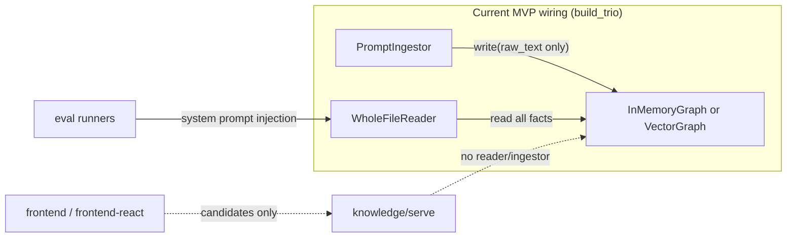

# Knowledge Module Gap Analysis

**Lite version context:** This repo is the **praxis-lite** implementation Monica builds in parallel with the full system. Monica serves as Daily Scrum Master (10:00 AM syncs). See [docs/plans/PRAXIS_Project_Plan.html](../plans/PRAXIS_Project_Plan.html) for the locked architecture, Lite framing, and **🎯 Capstone Alignment (PRD)** box.

**Saved:** 2026-06-19 (for review)  
**Related:** [PLAN_ALIGNMENT_GAP_CHECKLIST.md](PLAN_ALIGNMENT_GAP_CHECKLIST.md) · [PRAXIS_Project_Plan.html](../plans/PRAXIS_Project_Plan.html)

**Overview:** `graph_reader`, `injestion`, and `injestor_variants` are the correct contracts for the knowledge loop, but today they are MVP stubs (`WholeFileReader` + `PromptIngestor` only). They can close a meaningful slice of plan requirements if extended — but cannot alone satisfy the full demo-critical path without serve API, eval harness, and dashboard wiring.

---

## Can graph_reader / injestion / injestor_variants meet all plan requirements?

**Short answer: No — not with what exists today, and not by extending only these three packages.** They are the right **ingest → store → read → inject** spine from [PRAXIS_Project_Plan.html](../plans/PRAXIS_Project_Plan.html), but roughly half of demo-critical requirements live in adjacent systems (candidate API promote path, eval measurement, session capture, dashboard, infra).

**What you *can* do:** Extend these modules to close the **knowledge substrate** gaps (distillation input, safety/dedup at write, ranked retrieval, provenance-bearing injection). That unlocks Matthew’s pillar and unblocks Dominic’s cold-vs-injected evals — but only after thin integration layers in `knowledge/serve/` and `knowledge/evals/`.

---

## What exists today



| Module | Current state | Variant count |
|--------|---------------|---------------|
| [`knowledge/injestion/injestor_variants/`](../../knowledge/injestion/injestor_variants/) | [`PromptIngestor`](../../knowledge/injestion/injestor_variants/prompt_injestor.py) — passthrough or one LLM call, line-split | **1** |
| [`knowledge/graph_reader/grapher_reader_variants/`](../../knowledge/graph_reader/grapher_reader_variants/) | [`WholeFileReader`](../../knowledge/graph_reader/grapher_reader_variants/whole_file_reader.py) — dumps entire graph; `as_claude_tool` defined but not used in runners | **1** |
| [`knowledge/wiring.py`](../../knowledge/wiring.py) | Always `PromptIngestor` + `WholeFileReader` regardless of `substrate` | — |

**Already built adjacent to ingestor/reader (not in those packages):**

- Vector write policy: Redactor → Deduper → ConflictFlagger in [`knowledge/knowledge_graph/write_policy/`](../../knowledge/knowledge_graph/write_policy/)
- [`Insight`](../../knowledge/injestion/injestion_def.py) metadata fields (`source`, `confidence`, `scope`, …) — **defined but not flowed**: `Ingestor.ingest()` only calls `graph.write(insight.raw_text)` ([`parent_injestor.py`](../../knowledge/injestion/parent_injestor.py) line 33)
- [`pipeline_adapter`](../../knowledge/serve/pipeline_adapter.py) — offline mock insights → dashboard candidates (not live ingest)

---

## Requirements map: what these modules CAN close

### A. Extendable via **injestor_variants** (high leverage)

| Plan requirement | How to extend | Notes |
|------------------|---------------|-------|
| JSONL ingest + episode segmentation (P0) | New `JsonlLineIngestor` / `EpisodeIngestor` variant | Parse `session-capture` JSONL or fixture `logs/*.jsonl`; emit one `Insight` per learning moment with `source=logs/foo.jsonl:42` |
| Learning-moment detection (P0 minimum) | `HeuristicMomentIngestor` | Regex/heuristics on user corrections, failure→fix pairs; no ML required for demo |
| LLM distillation → structured lesson (P0) | `StructuredDistillIngestor` extends `PromptIngestor` pattern | Prompt for `{when, lesson, scope, evidence}`; populate `Insight` fields; keep passthrough fallback for CI |
| Provenance on every lesson (PC-1) | Fix **parent** `Ingestor.ingest()` + `KnowledgeGraph.write()` contract | Must pass full `Insight`/`Fact`, not `raw_text` only — blocked today at frozen `write(content: str)` |
| `POST /ingest/jsonl` (frontend already calls it) | Thin handler in [`knowledge/serve/app.py`](../../knowledge/serve/app.py) that calls `build_trio().ingestor` | **Not** an ingestor change alone — needs API route |

**Baseline doc explicitly defers structured LLM extraction** in the first “Minimal + safety” cut ([`2026-06-18-knowledge-baseline-requirements.md`](../../docs/brainstorms/2026-06-18-knowledge-baseline-requirements.md) line 29), but README P0 and gap checklist treat JSONL→structured candidates as **demo-critical**.

### B. Extendable via **graph_reader** variants (high leverage)

| Plan requirement | How to extend | Notes |
|------------------|---------------|-------|
| Get-context tool / JIT retrieval (KG-2, ING-8) | Implement planned `RetrievingReader` in `grapher_reader_variants/` | BM25 + dense + RRF + rerank per baseline doc; wire `build_trio(substrate="vector")` to use it instead of `WholeFileReader` |
| Lost-in-the-middle mitigation | Edge-ordered assembly in retrieval pipeline | Eval cases `lost_in_middle`, `context_budget_overload` are acceptance tests |
| Confidence/decay filtering at injection (PC-9) | `FilteredReader` wrapper or logic inside `RetrievingReader` | Filter `Fact` where state=active and confidence ≥ threshold; requires metadata on facts |
| `read_knowledge` Claude tool | Register `as_claude_tool(reader)` in agent loop | Adapter exists; eval runners still inject full graph via `--append-system-prompt` |
| Promoted-only injection (ING-9 partial) | Reader reads from graph that only contains `active` facts | Depends on promote→`write` path populating graph with correct lifecycle state |

### C. What **injestion + graph_reader together** enable for eval/demo

| Requirement | Mechanism |
|-------------|-----------|
| Seeded eval cases (`via_ingestor`) | Already works for text passthrough |
| Dedup / redaction / contradiction eval cases | Requires `substrate: vector` + metadata flow into `Fact` |
| Poison negative control | Reader must **exclude** rejected/decayed facts — WholeFileReader fails this today |
| End-to-end: log → candidates → promote → eval | Needs ingestor variants **+** promote handler writing to same `VectorGraph` instance **+** reader filtering |

---

## Requirements these modules CANNOT satisfy alone

| Requirement | Owner / location | Why not ingestor/reader only |
|-------------|----------------|------------------------------|
| Human gate UI (HG-1–HG-13) | [`frontend/`](../../frontend/), [`frontend-react/`](../../frontend-react/) | **Done (mock)** — separate pillar |
| Promote → `KnowledgeGraph.write` (P0) | [`knowledge/serve/app.py`](../../knowledge/serve/app.py) `POST /candidates/{id}/promote` | Today promotes in `CandidateStore` only; no `build_trio()` call |
| Cold vs injected paired eval (EV-2, EV-4) | [`knowledge/evals/run.py`](../../knowledge/evals/run.py) | Harness orchestration, not ingestor |
| Compounding curve + real `/metrics` (EV-5, EV-10) | Dominic eval batch + serve | Measurement spine |
| Session logs → DynamoDB (ING-5) | [`session-capture/`](../../session-capture/) | **Done** — Go daemon; Python ingestor must consume exported JSONL |
| HDBSCAN clustering (PC-6) | New consolidate module or write-policy step | Not in ingestor ABC today; `Deduper` is cosine-threshold, not HDBSCAN |
| CLAUDE.md / skills file generation (ING-9) | New generator module | Complementary substrate; not a reader variant |
| GitHub hook on promote (ING-4, EV-13) | Dominic integration | Outside knowledge packages |
| RDS facts persistence (KG-8) | [`postgres_store`](../../knowledge/serve/postgres_store.py), infra | Candidate store shipped; KG `facts` table not written by app yet |
| Real confidence scorer freq/recency/breadth (PC-2) | Scoring module + log replay | `pipeline_adapter` uses heuristics on mock JSON |
| Decay rules `active → decayed` (PC-4) | Scheduled job or promote/reject policy | UI shows `decayed`; no pipeline enforcement |
| CI pipeline | Team | Not knowledge-module scope |

---

## Recommended extension path

Priority order aligned with [PLAN_ALIGNMENT_GAP_CHECKLIST.md](PLAN_ALIGNMENT_GAP_CHECKLIST.md) integration gate (Jun 24):

### 1. Unblock metadata flow (foundation — touches parent contracts)

- Extend `KnowledgeGraph.write()` to accept `Insight` or `Fact` (keep `write(str)` for backward compat)
- Change `Ingestor.ingest()` to pass full insight to store
- `VectorGraph.read()` / `RetrievingReader` can then emit provenance in injection text (fixes `ingestion_retain_provenance` eval)

### 2. Add injestor variants (parallel work)

| Variant | Input | Output |
|---------|-------|--------|
| `JsonlIngestor` | JSONL path or line | `Insight[]` with `source` per line |
| `HeuristicLearningMomentIngestor` | episode text | moments with category hints |
| `StructuredDistillIngestor` | observation + LLM | `{when, lesson, scope}` in `Insight` |

Keep `PromptIngestor` as the simple default for eval cases that only need passthrough.

### 3. Implement `RetrievingReader` + wiring change

Per [baseline requirements](../../docs/brainstorms/2026-06-18-knowledge-baseline-requirements.md):

```python
# knowledge/wiring.py (target state)
if substrate == "vector":
    reader = RetrievingReader(graph)  # graph must be SearchableGraph
else:
    reader = WholeFileReader(graph)
```

### 4. Thin integration (not optional for “all requirements”)

- **`serve/app.py`**: `POST /ingest/jsonl` → ingestor; promote → `graph.write(active_fact)`
- **`evals/run.py`**: paired cold/injected runs using same reader
- **Shared graph instance**: API process must hold or reload `VectorGraph` / RDS-backed store — today eval and serve are separate lifecycles

---

## Demo realism: what mock path already covers

For Jun 29, Act 2 (human gate) is **mock-ready** without extending ingestor/reader. Acts 1 and 3 need the extensions above plus Dominic’s measurement.

| Demo act | ingestor/reader sufficient? | Fallback |
|----------|----------------------------|----------|
| Act 1 — dumb agent | No (needs quirky repo + cold eval) | Recorded clip |
| Act 2 — distillation + gate | Partial (mock `pipeline-insights.json` + dashboard) | **Mock OK today** |
| Act 3 — smart agent + scoreboard | Yes **if** reader filters promoted facts + eval shows improvement | Fixture [`eval-metrics.json`](../integration/fixtures/eval-metrics.json) |

---

## Bottom line

| Question | Answer |
|----------|--------|
| Can **current** graph_reader / injestion meet all plan requirements? | **No** — MVP stubs cover ~foundation tier only ([README](../../README.md)) |
| Can **extended** variants meet **all** requirements? | **No** — dashboard, promote wiring, eval pairing, metrics, infra, and GitHub hooks remain outside |
| Can extended variants meet the **knowledge-loop P0** (log → candidates → promote → better agent)? | **Yes, with 4–5 focused changes**: metadata flow, 2–3 ingestor variants, `RetrievingReader`, promote→graph in serve, eval pairing |
| Best use of `injestor_variants` folder | Add JSONL + heuristic + structured distill variants; keep `PromptIngestor` for CI |
| Best use of `graph_reader` variants | Build `RetrievingReader` + optional confidence/decay filter; wire `as_claude_tool` for get-context |

**Monica-specific angle:** Dashboard pillar is largely complete on mock data. Extending ingestor/reader is Matthew’s critical path; highest-value Monica contribution to those modules is **eval cases** that specify provenance shape, injection behavior, and cold-vs-seeded prompts ([gap checklist eval authoring section](PLAN_ALIGNMENT_GAP_CHECKLIST.md)) — plus integration smoke once `POST /ingest/jsonl` and promote→graph land.

---

## Action items (tracked)

- [ ] Extend `Ingestor.ingest()` and `KnowledgeGraph.write()` to pass `Insight`/`Fact` metadata (provenance, scope, confidence) — foundation for all other work
- [ ] Add `JsonlIngestor` + `HeuristicLearningMomentIngestor` + `StructuredDistillIngestor` under `injestor_variants/`
- [ ] Implement `RetrievingReader` + `retrieval/` pipeline; update `build_trio()` to select reader by substrate
- [ ] Wire `knowledge/serve`: `POST /ingest/jsonl` and promote → `KnowledgeGraph.write` on shared graph store
- [ ] Dominic: cold vs injected paired runner + correction metrics using reader injection path
- [ ] Monica: eval cases specifying provenance, decay filter, and cold-vs-seeded prompts for new variants
